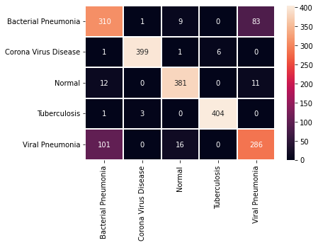

# Multi-Class Classification of Lung Diseases Using CNN Models

#### we propose a multi-class classification model that can cover a wider range of lung diseases by learning a total of five classes, from three lung diseases such as Viral Pneumonia,  Bacterial Pneumonia ,Corona Virus, and Tuberculosis, to Normal which is the negative state.

#### The dataset used to build this model: https://www.kaggle.com/datasets/omkarmanohardalvi/lungs-disease-dataset-4-types

## Results

## Confusion Matrix
